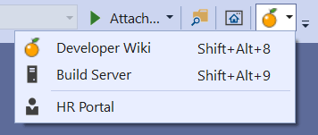

# My Company extension

The easiest way to share links relevant to all developers in your team

Download the [CI build](https://www.vsixgallery.com/extension/61a7ba6e-0cd8-4912-a6c0-ff3f86d79c2e).

-----------------------------------------

Use this as the starting point for creating an extension for your team. The extension puts a button with your company logo on the *Standard* toolbar that shows a sub-menu with links relevant to developers on your team.

**Steps to customize**

1. Fork the repo
2. Change the ID (guid) in *source.extension.vsixmanifest*
3. Modify or add buttons in *VSCommandTable.vsct*
4. Modify and add URLs for the buttons in the *MyCompanyPackage.cs*
5. Change the orange fruit icons to your company logo

## License
[Apache 2.0](LICENSE)